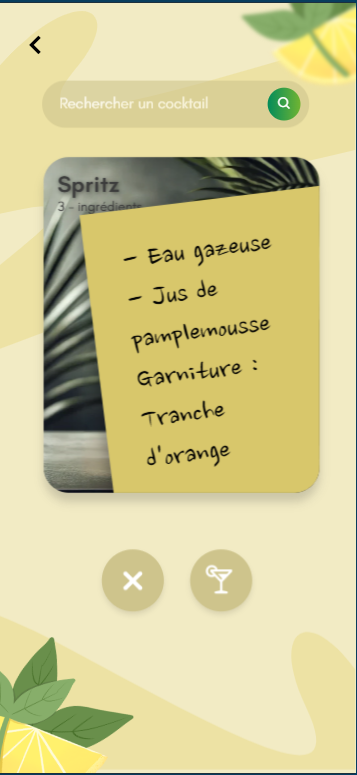
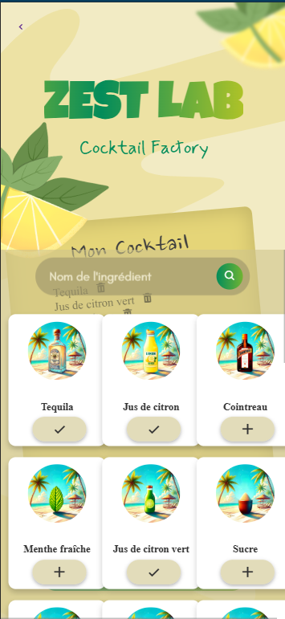

# 🍋 Zest Lab - Cocktail Factory

Bienvenue dans **Zest Lab**, un projet pédagogique développé par un groupe de 7 étudiants en 1ère et 2ème année de Bachelor Informatique dans le cadre de l’année scolaire 2024–2025.

Ce projet vous plonge dans un univers rafraîchissant où vous pouvez **découvrir, créer et personnaliser des cocktails** à partir d’une base de données d’ingrédients, le tout dans une interface mobile-first fun et intuitive !

---

## 🧑‍💻 Équipe

- Groupe de 7 étudiants
- Bachelor Informatique – Année 2024–2025
- Répartition front/back et base de données collaborative

---

## 🔧 Technologies utilisées

### Frontend
- HTML5 / CSS3
- JavaScript Vanilla
- Design responsive (mobile first)
- UI/UX personnalisée

### Backend
- Node.js + Express
- API REST développée sur mesure
- Base de données **SQLite**

---

## 📸 Aperçu visuel

### Écrans principaux :

| Accueil                  | Match Cocktails          | Recherche               |
|--------------------------|--------------------------|--------------------------|
|  |  |  |

| Création Perso          | Sélection d’ingrédients  | Résultats recommandés   |
|--------------------------|--------------------------|--------------------------|
|  |  |  |

| Fiche cocktail détaillée |
|--------------------------|
|  |

---

## 🧪 Fonctionnalités principales

- 🔍 **Rechercher un cocktail** selon son nom
- 🍸 **Découvrir aléatoirement** des cocktails à tester
- ➕ **Composer un cocktail personnalisé** en ajoutant des ingrédients
- 🧠 **Suggestion intelligente** de cocktails possibles selon les ingrédients sélectionnés
- 📋 **Fiche détaillée** : Ingrédients, recette, visuel, note

---

## ⚙️ Lancer le projet

### Backend

```bash
cd backend
npm install
node index.js
```
