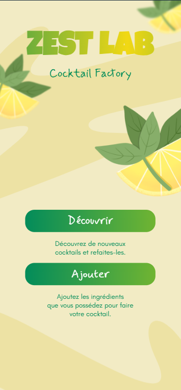
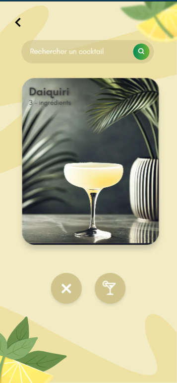
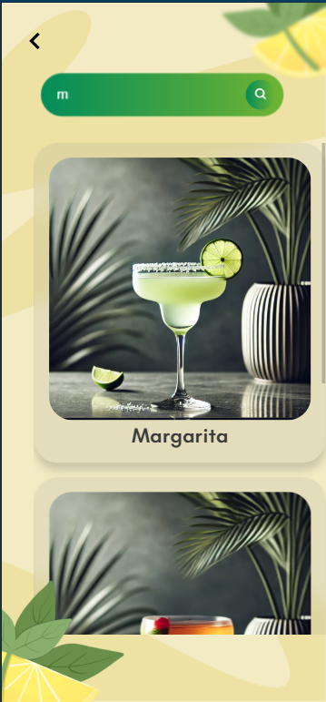
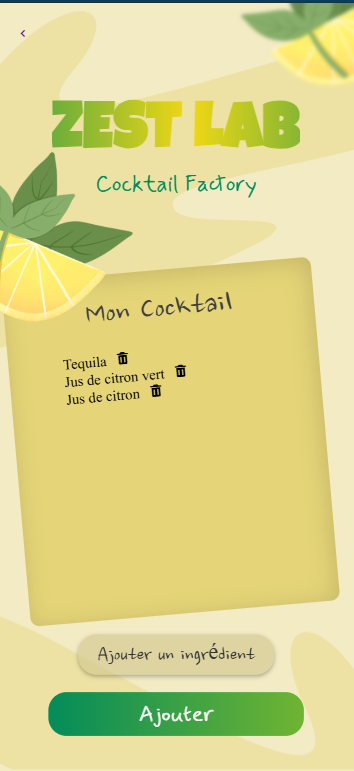
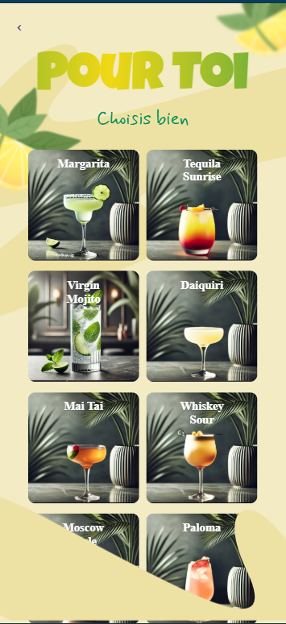
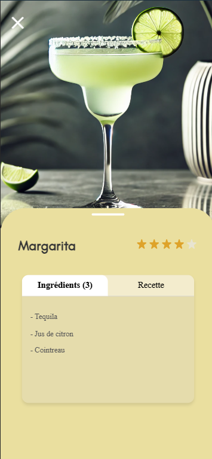

# 🍋 Zest Lab - Cocktail Factory

Bienvenue dans **Zest Lab**, un projet pédagogique développé par un groupe de 7 étudiants en 1ère et 2ème année de Bachelor Informatique dans le cadre de l’année scolaire 2024–2025.

Ce projet vous plonge dans un univers rafraîchissant où vous pouvez **découvrir, créer et personnaliser des cocktails** à partir d’une base de données d’ingrédients, le tout dans une interface mobile-first fun et intuitive !

---

## 🧑‍💻 Équipe

- Groupe de 7 étudiants
- Bachelor Informatique – Année 2024–2025
- Répartition front/back et base de données collaborative

---

## 🔧 Technologies utilisées

### Frontend
- HTML5 / CSS3
- JavaScript Vanilla
- Design Mobile first
- UI/UX personnalisée

### Backend
- Node.js + Express
- API REST développée sur mesure
- Base de données **SQLite**

---

## 📸 Aperçu visuel

### Écrans principaux :

| Accueil                  | Match Cocktails           | Recherche               |
|--------------------------|--------------------------|--------------------------|
|  |  |  |

| Sélection d’ingrédients       | Résultats recommandés         | Fiche cocktail détaillée|
|-------------------------------|-------------------------------|-------------------------|
[  |  |  |


---

## 🧪 Fonctionnalités principales

- 🔍 **Rechercher un cocktail** selon son nom
- 🍸 **Découvrir aléatoirement** des cocktails à tester
- 🧠 **Suggestion intelligente** de cocktails possibles selon les ingrédients sélectionnés
- 📋 **Fiche détaillée** : Ingrédients, recette, visuel, note

---

## ⚙️ Lancer le projet

### Backend

```bash
cd backend
npm install
node app.js
```

L’API est exposée sur http://localhost:3000.

### Frontend
Ouvrir le fichier index.html avec un navigateur ou servir avec une extension comme Live Server.

## 📁 Structure du projet
.
├── backend/               → Serveur Express + API + SQLite
├── frontend/              → HTML/CSS/JS (pages + composants)
├── public/img             → Illustrations, photos de cocktails
├── README.md              → Vous êtes ici 🍹


## 📌 Objectifs pédagogiques
- 💡 Apprentissage du modèle client/serveur

- 🔄 Compréhension du fonctionnement d’une API REST

- 🎨 Développement d’un frontend interactif sans framework

- 🧩 Gestion de projet en équipe et intégration continue

## 📬 Contact
Pour toute question ou retour sur ce projet :

-Dantr3b – GitHub


